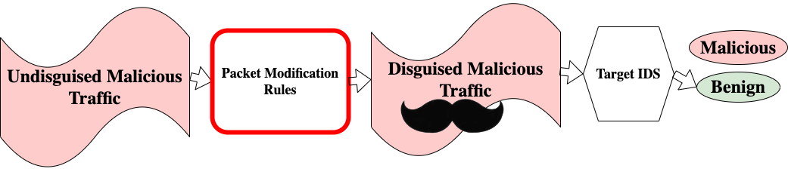

# idsattack
Packet modification to fool machine learning based network Intrusion Detection Systems (IDSs).

## System Overview
The goal of our system is to modify malicious traffic to make it appear benign to a target Intrusion Detection System (IDS). 
However, the important constraint in our project is that our modifications to traffic must not affect their functionality downstream!

## Results
By adding nop options to IPv4 packet headers in a way that is specifically targeted at the IDS [Whisper](https://github.com/fuchuanpu/Whisper), we see the following changes in AUC on Whisper's testing set. 

| Attack Type         | Clean Traffic AUC   | Modified Traffic AUC  |
| ------------------- | ------------------- | --------------------- |
| SSL Renegotiation   |             0.72    |               0.53    |
| Fuzzing             |             0.61    |               0.45    |
| Syn DoS             |             0.56    |               0.33    |
| Video Injection     |             0.52    |               0.31    |
| ARP MITM            |             0.51    |               0.30    |
| Active Wiretap      |             0.51    |               0.31    |
| OS Scan             |             0.04    |               0.04    |
| SSDP Flood          |           < 0.01    |             < 0.01    |

## Datasets
We evaluate our system on datasets from [Kitsune](https://github.com/ymirsky/Kitsune-py). 
The datasets can be found in the [UC Irvine Machine Learning Repository](https://archive.ics.uci.edu/ml/machine-learning-databases/00516).

The script `download_datasets.py` will download the datasets from the repository. 
Alternatively, you can use these links to download archives containing the datasets:
- [Archive with all datasets](https://drive.google.com/file/d/10uN4b4vnvONGEzB54QBfb5V6X39eg571/view?usp=share_link)
- [Archive with training set](https://drive.google.com/file/d/1ephZY35lOUj3i7bzATCmcxgBIymjseEi/view?usp=share_link)
- [Archive with testing set](https://drive.google.com/file/d/10NBdq8gkAdT-7husfMtoorir0hzw9MJm/view?usp=share_link)
- [Archive with disguised testing set](https://drive.google.com/file/d/172IttXzyIResigHv98g1kkEb3BFqZvj-/view?usp=share_link)

## Reproducing Results
### Setting up Environment
1. This projects dependencies are listed in `requirements.txt`. You can create a virtual environment with the required dependencies with `python3 pip install -r requirements.txt`. 
2. You will need to download one or more of the datasets listed above. The AUC scores for "clean traffic" were collected for the [testing set](https://drive.google.com/file/d/172IttXzyIResigHv98g1kkEb3BFqZvj-/view?usp=share_link). The AUC scores for "disguised traffic" were collected for the [disguised testing set](https://drive.google.com/file/d/172IttXzyIResigHv98g1kkEb3BFqZvj-/view?usp=share_link). The version of Whisper used for detection was trained on benign traffic from the [training set](https://drive.google.com/file/d/10NBdq8gkAdT-7husfMtoorir0hzw9MJm/view?usp=share_link). 

### Training Whisper
1. Following [the paper describing Whisper](https://arxiv.org/pdf/2106.14707.pdf), we use only benign traffic from the first 20% of each traffic dataset to find cluster centroids. Training entails two steps. 
  a) **Find embeddings for the benign traffic:** `python3 get_embeddings <train_dataset_path> <results_path> <num_processes>`. `train_dataset_path` is a directory that contains a subdirectory for each traffic dataset. The program will write the resulting embeddings as `.npz` files to the `results_path` directory. The program uses the multiprocessessing model to process each dataset in parallel. The number of processes used is defined by `num_processes`. Run `python3 get_embeddings -h` for more help with command line arguments.
  b) **Find centroids for the benign traffic for each attack type:** `python3 k_means_learner.py <embedding_dir_loc> <num_clusters> <save_loc>`. `embedding_dir_loc` should be the same path used in `results_path` of the previous step. We used 10 as the number of clusters in our experiments. The program will save the centroids to a directory called `save_loc` in which each traffic dataset will have a json file filled with centroids.
  
### Evaluating Whisper
1. Given centroids for each attack type, we can play back testing datasets to determine Whisper's accuracy. To run Whisper on each testing dataset, use the following command: `python3 run_detection.py <datasets_loc> <clusters_loc> <results_loc> <num_processes>`. 
  - `datasets_loc` is a directory which has a subdirectory for each testing traffic dataset.
  - `clusters_loc` is a directory which has a json file full of centroids for each attack type. 
  - The program will create a directory called `results_loc` that will contain csv files with a column for expected label, and a column for centroid distance. 
  - The program will run `num_processess` in parallel. Each process will run detection on a different dataset.
2. Given result .csv files, we can plot the ROC curves and find each curve's AUC by running `python3 plot_roc.py <results_loc> <save_loc> <plot_title>`. 
  - `results_loc` is the same `results_loc` that contains csv files with distance and expected label.
  - `save_loc` is a path for where to save the ROC plot.
  - `plot_title` is what to name the ROC curve. 

### Disguising Traffic
1. To disguise the traffic in the testing set, you can run `python3 disguiser.py <datasets_loc> <centroid_loc> <results_loc> <num_processes>`. 
  - `datasets_loc` is a directory that contains a subdirectory for each type of traffic in the testing set. 
  - `centroid_loc` is a directory that contains a json file full of centroids for each attack type. 
  - The program will write a heirarchy mirroring `datasets_loc` at `results_loc`. However, the .pcapng files at `results_loc` will be "disguised."
  - The program will run `num_processes` in parallel. Each process works on a different dataset. 

### Evaluating Whisper on Disguised Traffic
The process to evaluate Whisper on disguised traffic is largely the same as the process for evaluating Whisper on the regular testing set. Instead of using the directory of the testing set for `datasets_loc`, use the directory generated by running the disguiser. 
